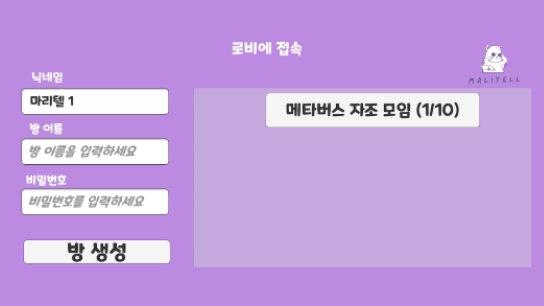
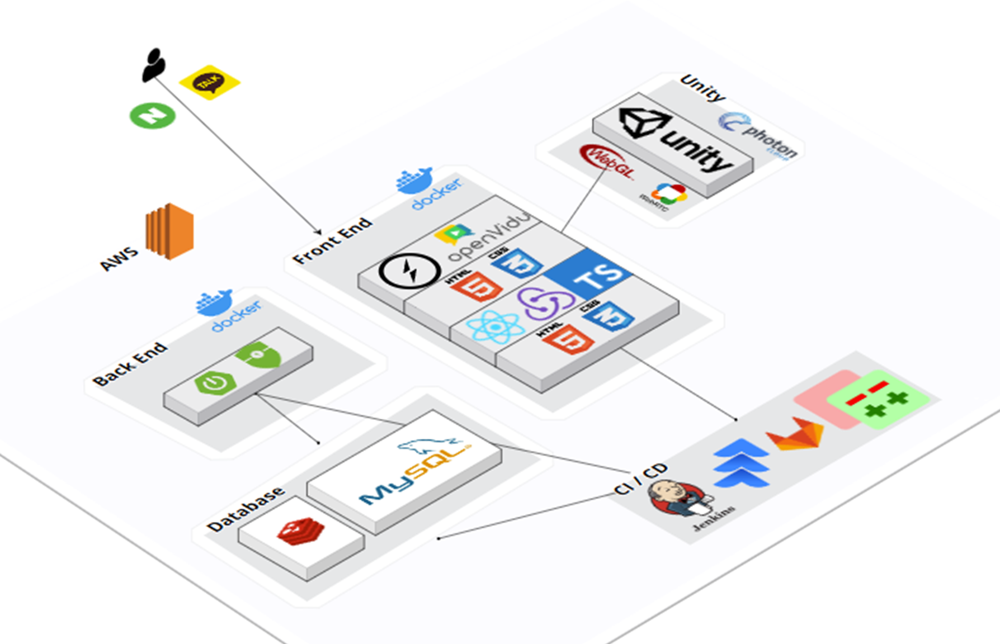
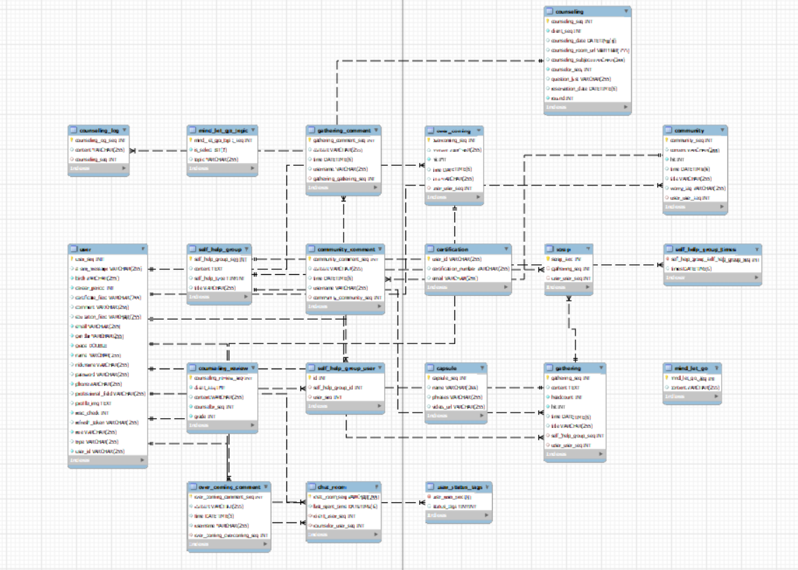

# C208 프로젝트
# 📺 마리텔 (Mind Listen & Tell)

### 심리 상담 및 메타버스 자조모임 제공 비대면 마음 치료소

- SSAFY 10기 2학기 공통 프로젝트 (WebRTC)
- 8팀 나죽나강팀

## 1. 프로젝트 기간

- 2024.1.3 ~ 2024.2.16

## 2. 팀원

🖱 김선욱 (팀장) : Metaverse / 발표/

🌍 김유나 (팀원) : Backend

😎 유세진 (팀원) : Backend

🍷 윤주찬 (팀원) : Frontend

📺 장동재 (팀원) : Frontend / 서버 배포

💪 한재현 (팀원) : Backend

## 3. 소개

마음의 문제를 겪는 사람들이 늘어나고 있는 우리나라. 하지만 사회적 인식과 같은 이유로 사람들은 정신과 혹은 심리 상담소 방문을 꺼려하는 추세입니다. 게다가 항우울제 소비량도 다른 나라에 비해 현저히 떨어집니다. 상담소를 직접 방문하지 않아도 된다면, 나와 비슷한 사람들과 이야기를 나누고 싶다면, 당신도 지금 마음을 털어놓고 싶다면, 여러분의 마음 치료사 **마리텔**을 이용해보세요!

## 4. 주요 기능

### 상담자 목록

- 상담자 프로필 사진, 이름, 경력 등 확인

### 전문가 1:1 채팅 상담

- 원하는 상담자에게 채팅 보내기
- 원하는 시간에 1:1 채팅을 통해 상담자와 상담
    
    
    

### 상담 예약

- 원하는 날짜와 시간에 상담 예약
    
    
    

### 전문가 1:1 화상 상담

- 캠과 마이크를 이용한 비대면 상담
- 화면에 나오는 본인 얼굴을 마주하고 싶지 않은 내담자를 위한 카메라 off 기능
- 단, 내담자의 동의 하에 상담자에게는 화면 공개
- 상담가가 상담을 진행하며 바로 상담일지 작성
- 상담이 종료되면 내담자가 상담후기 작성

### 메타버스 자조모임

- 방 생성 기능을 통해 원하는 자조 모임 참여 가능



- 아바타와 마이크를 이용한 메타버스 자조 모임
- 자유로운 커스터마이징

.gif>)

- 중재자의 진행을 위한 퀘스트 전체 공지 기능

.gif>)

- 채팅, 음성 채팅 등 다양한 소통 방법

.gif>)

- 다회차 자조모임을 위한 그림그리기 게임

.gif>)

### 대나무 숲

- 매주 바뀌는 주제를 제공
- 익명으로 게시글을 작성
    

    

### 마음 자판기

- 랜덤 명언 및 추천 영상/음악 제공
    
    
    

### 커뮤니티 - 자조모임 게시판

- 모임 시작 날짜와 총 회차만 입력해주면 자동으로 1주일 단위로 모임 날짜를 계산하여 게시글을 작성하는 기능 제공
    
    
    

## 6. 기술 스택 및 개발 환경

### **💻 IDE**

- Intellij
- Visual Studio Code

### **🔧** BackEnd

- Spring Boot `3.2.1`
- Spring Security `6.2.1`
- Spring Data JPA `3.2.1`
- OAuth2
- JWT `0.12.3`
- Stomp WebSocket `2.3.3-1`

### **🎨** FrontEnd

- Node.js  `20.11.0`
- npm `10.2.4`
- React `18.2.0`
- Redux-toolkit `2.1.0`
- type-script `4.9.5`
- openvidu-browser `2.29.1`

### 🎮 Metaverse

- Unity `2021.3.33f1`
- Photon Pun2 `2.45`
- Photon Voice2 `2.45`

### 🗑 Database

- MySQL `8.3.0`
- Redis `3.2.1`

### **🚀** Server

- AWS EC2

### ⌛ CI/CD

- Docker `24.0.5`
- Jenkins `2.440`
- Nginx `1.18.0 (Ubuntu)`
- SSL

### **🤝** 협업

- GitLab
- Jira
- Notion
- Mattermost

## 7. 시스템 아키텍처



## 8. Project Structure

<details>
<summary>Backend</summary>

    ```
    \---src
        \---main
            +---java
            |   \---com
            |       \---ssafy
            |           \---malitell
            |               |   Initializer.java
            |               |   MalitellApplication.java
            |               |
            |               +---config
            |               |       RedisCacheConfig.java
            |               |       RedisConfig.java
            |               |       SecurityConfig.java
            |               |       WebSocketConfig.java
            |               |
            |               +---controller
            |               |       AuthController.java
            |               |       CapsuleController.java
            |               |       ChatController.java
            |               |       CommentController.java
            |               |       CommunityController.java
            |               |       CounselingController.java
            |               |       GatheringController.java
            |               |       MessageController.java
            |               |       MindLetGoController.java
            |               |       OverComingController.java
            |               |       ScrapController.java
            |               |       SelfHelpGroupController.java
            |               |       UserController.java
            |               |
            |               +---domain
            |               |   +---auth
            |               |   |       CustomOAuth2User.java
            |               |   |       emailAuth.java
            |               |   |
            |               |   +---board
            |               |   |   |   Community.java
            |               |   |   |   Gathering.java
            |               |   |   |   OverComing.java
            |               |   |   |
            |               |   |   \---comment
            |               |   |           CommunityComment.java
            |               |   |           GatheringComment.java
            |               |   |           OverComingComment.java
            |               |   |
            |               |   +---capsule
            |               |   |       Capsule.java
            |               |   |
            |               |   +---chat
            |               |   |       ChatMessage.java
            |               |   |       ChatRoom.java
            |               |   |
            |               |   +---counseling
            |               |   |       Counseling.java
            |               |   |       CounselingLog.java
            |               |   |       CounselingReview.java
            |               |   |
            |               |   +---mindletgo
            |               |   |       MindLetGo.java
            |               |   |       MindLetGoTopic.java
            |               |   |
            |               |   +---scrap
            |               |   |       Scrap.java
            |               |   |
            |               |   +---selfhelpgroup
            |               |   |       SelfHelpGroup.java
            |               |   |       SelfHelpGroupUser.java
            |               |   |       SelfHelpType.java
            |               |   |
            |               |   +---tag
            |               |   |       StatusTag.java
            |               |   |       WorryTag.java
            |               |   |       WorryTagConverter.java
            |               |   |
            |               |   \---user
            |               |           User.java
            |               |
            |               +---dto
            |               |   +---request
            |               |   |   +---auth
            |               |   |   |       CheckCertificationRequestDto.java
            |               |   |   |       EmailCertificationRequestDto.java
            |               |   |   |       FindIdRequestDto.java
            |               |   |   |       IdCheckRequestDto.java
            |               |   |   |       PasswordRequestDto.java
            |               |   |   |       SignUpRequestDto.java
            |               |   |   |
            |               |   |   +---board
            |               |   |   |   +---comment
            |               |   |   |   |       CommentRequestDto.java
            |               |   |   |   |
            |               |   |   |   +---community
            |               |   |   |   |       CommunityRequestDto.java
            |               |   |   |   |       CommunityUpdateRequestDto.java
            |               |   |   |   |
            |               |   |   |   +---gathering
            |               |   |   |   |       GatheringCreateRequestDto.java
            |               |   |   |   |       GatheringUpdateRequestDto.java
            |               |   |   |   |
            |               |   |   |   \---overcoming
            |               |   |   |           OverComingRequestDto.java
            |               |   |   |           OverComingUpdateRequestDto.java
            |               |   |   |
            |               |   |   +---chat
            |               |   |   |       ChatMessageDto.java
            |               |   |   |       ChatMessageRequestDto.java
            |               |   |   |       ChatRequestDto.java
            |               |   |   |       ChatRoomDto.java
            |               |   |   |
            |               |   |   +---counseling
            |               |   |   |       CounselingLogRequestDto.java
            |               |   |   |       CounselingReviewRequestDto.java
            |               |   |   |       ReserveRequestDto.java
            |               |   |   |
            |               |   |   +---mindletgo
            |               |   |   |       MindLetGoRequestDto.java
            |               |   |   |
            |               |   |   +---scrap
            |               |   |   |       ScrapRequestDto.java
            |               |   |   |
            |               |   |   +---tag
            |               |   |   |       TagRequestDto.java
            |               |   |   |
            |               |   |   \---user
            |               |   |           ClientJoinRequestDto.java
            |               |   |           ClientUpdateRequestDto.java
            |               |   |           CounselorJoinRequestDto.java
            |               |   |           CounselorUpdateRequestDto.java
            |               |   |
            |               |   \---response
            |               |       |   ResponseDto.java
            |               |       |
            |               |       +---auth
            |               |       |       CheckCertificationResponseDto.java
            |               |       |       EmailCertificationResponseDto.java
            |               |       |       FindIdResponseDto.java
            |               |       |       IdCheckResponseDto.java
            |               |       |       SignUpResponseDto.java
            |               |       |
            |               |       +---board
            |               |       |   |   MyBoardListResponseDto.java
            |               |       |   |
            |               |       |   +---comment
            |               |       |   |       CommentResponseDto.java
            |               |       |   |
            |               |       |   +---community
            |               |       |   |       CommunityListResponseDto.java
            |               |       |   |       CommunityResponseDto.java
            |               |       |   |
            |               |       |   +---gathering
            |               |       |   |       BoardResponseDto.java
            |               |       |   |       GatheringListResponseDto.java
            |               |       |   |       GatheringResponseDto.java
            |               |       |   |       GatheringScrapResponseDto.java
            |               |       |   |
            |               |       |   \---overcoming
            |               |       |           OverComingListResponseDto.java
            |               |       |           OverComingResponseDto.java
            |               |       |
            |               |       +---capsule
            |               |       |       CapsuleResponseDto.java
            |               |       |
            |               |       +---chat
            |               |       |       ChatMessageResponseDto.java
            |               |       |       ChatRoomResponseDto.java
            |               |       |
            |               |       +---counseling
            |               |       |       CounselingLogOrderByDateResponseDto1.java
            |               |       |       CounselingLogOrderByDateResponseDto2.java
            |               |       |       CounselingLogResponseDto.java
            |               |       |       CounselorResponseDto.java
            |               |       |       CounselorReviewResponseDto.java
            |               |       |       MyCounselingLogResponseDto.java
            |               |       |       MyCounselingReviewResponseDto.java
            |               |       |       ReservationInfoResponseDto.java
            |               |       |       ReservationListResponseDto.java
            |               |       |
            |               |       +---mindletgo
            |               |       |       MindLetGoListDto.java
            |               |       |       MindLetGoTopicResponseDto.java
            |               |       |
            |               |       +---selfhelpgroup
            |               |       |       SelfHelpGroupResponseDto.java
            |               |       |
            |               |       \---user
            |               |               ClientResponseDto.java
            |               |               CounselorResponseDto.java
            |               |               CustomUserDetails.java
            |               |               UserResponseDto.java
            |               |
            |               +---handler
            |               |       OAuth2SuccessHandler.java
            |               |       StompHandler.java
            |               |
            |               +---jwt
            |               |       JWTFilter.java
            |               |       JWTUtil.java
            |               |       LoginFilter.java
            |               |
            |               +---repository
            |               |   +---board
            |               |   |   +---community
            |               |   |   |       CommunityCommentRepository.java
            |               |   |   |       CommunityRepository.java
            |               |   |   |
            |               |   |   +---gathering
            |               |   |   |       GatheringCommentRepository.java
            |               |   |   |       GatheringRepository.java
            |               |   |   |
            |               |   |   \---overcoming
            |               |   |           OverComingCommentRepository.java
            |               |   |           OverComingRepository.java
            |               |   |
            |               |   +---capsule
            |               |   |       CapsuleRepository.java
            |               |   |
            |               |   +---chat
            |               |   |       ChatMessageMongoRepository.java
            |               |   |       ChatMessageRepository.java
            |               |   |       ChatRoomRepository.java
            |               |   |
            |               |   +---counseling
            |               |   |   |   CounselingRepository.java
            |               |   |   |   CounselingRepositoryCustom.java
            |               |   |   |   CounselingRepositoryImpl.java
            |               |   |   |
            |               |   |   +---log
            |               |   |   |       CounselingLogRepository.java
            |               |   |   |
            |               |   |   \---review
            |               |   |           CounselingReviewRepository.java
            |               |   |           CounselingReviewRepositoryCustom.java
            |               |   |           CounselingReviewRepositoryImpl.java
            |               |   |
            |               |   +---mindletgo
            |               |   |       MindLetGoRepository.java
            |               |   |       MindLetGoTopicRepositoryImpl.java
            |               |   |
            |               |   +---scrap
            |               |   |       ScrapRepository.java
            |               |   |       ScrapRepositoryImpl.java
            |               |   |
            |               |   +---selfhelpgroup
            |               |   |       SelfHelpGroupRepository.java
            |               |   |       SelfHelpGroupUserRepository.java
            |               |   |
            |               |   \---user
            |               |           CertificationRepository.java
            |               |           UserRepository.java
            |               |           UserRepositoryCustom.java
            |               |           UserRepositoryImpl.java
            |               |
            |               +---service
            |               |   |   AuthService.java
            |               |   |   CapsuleService.java
            |               |   |   CommunityCommentService.java
            |               |   |   CommunityService.java
            |               |   |   CounselingService.java
            |               |   |   CustomUserDetailsService.java
            |               |   |   GatheringCommentService.java
            |               |   |   GatheringService.java
            |               |   |   MindLetGoService.java
            |               |   |   OverComingCommentService.java
            |               |   |   OverComingService.java
            |               |   |   ScrapService.java
            |               |   |   SelfHelpGroupService.java
            |               |   |   UserService.java
            |               |   |
            |               |   +---chat
            |               |   |       ChatService.java
            |               |   |       RedisPublisher.java
            |               |   |       RedisSubscriber.java
            |               |   |
            |               |   \---implement
            |               |           AuthServiceImplement.java
            |               |           OAuth2UserServiceImplement.java
            |               |
            |               \---util
            |                       AESUtil.java
            |                       CertificationNumber.java
            |                       EmailUtil.java
            |                       ResponseCode.java
            |                       ResponseMessage.java
            |                       Scheduler.java
            |
            \---resources
                    application.properties
    ```
</details>

<details>
<summary>Frontend</summary>

    ```jsx
    src
    ├─ App.tsx
    ├─ assets
    │  ├─ fonts
    │  │  ├─ Font.css
    │  │  └─ NanumSquareNeo-Variable.woff
    │  └─ images
    │     ├─ auth
    │     │  ├─ login
    │     │  │  ├─ kakao.png
    │     │  │  └─ naver.png
    │     │  └─ signup
    │     │     ├─ client.png
    │     │     └─ counselor.png
    │     ├─ banner
    │     │  ├─ bamboo.png
    │     │  ├─ counsel.png
    │     │  ├─ metaverse.png
    │     │  └─ worry.png
    │     ├─ favicon.png
    │     ├─ malitell.png
    │     ├─ nav
    │     │  └─ logo.png
    │     ├─ star.png
    │     └─ vendingMachine
    │        ├─ cardBack.png
    │        ├─ cardFront.png
    │        ├─ explosion.gif
    │        ├─ fast.gif
    │        ├─ lastFrame.png
    │        └─ normal.gif
    ├─ components
    │  ├─ article
    │  │  ├─ articleCreate
    │  │  │  ├─ createArticleForm.tsx
    │  │  │  ├─ createGatherForm.tsx
    │  │  │  └─ createOvercomeForm.tsx
    │  │  ├─ articleDetail
    │  │  │  ├─ comment.tsx
    │  │  │  ├─ commentList.tsx
    │  │  │  ├─ communityContent.tsx
    │  │  │  ├─ createComment.tsx
    │  │  │  ├─ gatherContent.tsx
    │  │  │  ├─ overcomeContent.tsx
    │  │  │  ├─ search.tsx
    │  │  │  ├─ title.tsx
    │  │  │  ├─ titleGather.tsx
    │  │  │  ├─ titleOvercome.tsx
    │  │  │  └─ types.ts
    │  │  ├─ articleList
    │  │  │  ├─ article.tsx
    │  │  │  ├─ articleList.tsx
    │  │  │  ├─ articleMenu.tsx
    │  │  │  ├─ filter.tsx
    │  │  │  └─ searchBox.tsx
    │  │  ├─ components.md
    │  │  └─ recommendedArticle.tsx
    │  ├─ auth
    │  │  ├─ login
    │  │  │  ├─ login.tsx
    │  │  │  └─ loginEmail.tsx
    │  │  ├─ profile
    │  │  │  ├─ current.tsx
    │  │  │  ├─ currentMenu.tsx
    │  │  │  ├─ menu.tsx
    │  │  │  ├─ myArticle.tsx
    │  │  │  ├─ myCounselClient.tsx
    │  │  │  ├─ myCounselCounselor.tsx
    │  │  │  ├─ myGathering.tsx
    │  │  │  ├─ myInfoClient.tsx
    │  │  │  ├─ myReservation.tsx
    │  │  │  ├─ myReview.tsx
    │  │  │  ├─ myScrab.tsx
    │  │  │  └─ passwordChange.tsx
    │  │  └─ signup
    │  │     ├─ certification.tsx
    │  │     ├─ client
    │  │     │  └─ clientForm.tsx
    │  │     ├─ complete.tsx
    │  │     ├─ counselor
    │  │     │  └─ counselorForm.tsx
    │  │     ├─ regex.ts
    │  │     ├─ selection
    │  │     │  └─ selection.tsx
    │  │     └─ signup.tsx
    │  ├─ bamboo
    │  │  ├─ filter.tsx
    │  │  ├─ message.tsx
    │  │  ├─ messageCreate.tsx
    │  │  ├─ messageList.tsx
    │  │  ├─ modal.tsx
    │  │  └─ subject.tsx
    │  ├─ chat
    │  │  ├─ chatting.tsx
    │  │  └─ list.tsx
    │  ├─ common
    │  │  ├─ banners
    │  │  │  ├─ bamboo.tsx
    │  │  │  └─ metaverse.tsx
    │  │  ├─ nav.tsx
    │  │  ├─ notification.tsx
    │  │  ├─ vendingMachine
    │  │  │  ├─ card.tsx
    │  │  │  ├─ content.tsx
    │  │  │  └─ modal.tsx
    │  │  └─ vendingmachine.tsx
    │  ├─ counsel
    │  │  ├─ components.md
    │  │  ├─ counselorDetail
    │  │  │  ├─ buttonBox.tsx
    │  │  │  ├─ counselorInfo.tsx
    │  │  │  ├─ createChat.tsx
    │  │  │  ├─ profileBox.tsx
    │  │  │  ├─ review.tsx
    │  │  │  └─ reviewList.tsx
    │  │  └─ counselorList
    │  │     ├─ counselor.tsx
    │  │     ├─ counselors.tsx
    │  │     ├─ createChat.tsx
    │  │     ├─ filter.tsx
    │  │     └─ searchBox.tsx
    │  ├─ counselling
    │  │  ├─ Chat.tsx
    │  │  ├─ Controls.tsx
    │  │  ├─ Form.tsx
    │  │  ├─ Session.tsx
    │  │  └─ Video.tsx
    │  ├─ home
    │  │  ├─ articles.tsx
    │  │  ├─ banners
    │  │  │  ├─ bamboo.tsx
    │  │  │  └─ metaverse.tsx
    │  │  ├─ carousel.tsx
    │  │  ├─ components.md
    │  │  ├─ counsel.tsx
    │  │  └─ nav.tsx
    │  └─ reservation
    │     └─ reservationFirst
    │        └─ buttonBox.tsx
    ├─ custom.d.ts
    ├─ index.tsx
    ├─ routes
    │  ├─ article
    │  │  ├─ articleCreate.tsx
    │  │  ├─ articleDetail.tsx
    │  │  ├─ articleList.tsx
    │  │  └─ articleUpdate.tsx
    │  ├─ auth
    │  │  └─ profile.tsx
    │  ├─ bamboo
    │  │  └─ bamboo.tsx
    │  ├─ counsel
    │  │  ├─ counselEvaluation.tsx
    │  │  ├─ counselingClient.tsx
    │  │  ├─ counselingCounselor.tsx
    │  │  ├─ counselingNotice.tsx
    │  │  ├─ counselorDetail.tsx
    │  │  ├─ counselorList.tsx
    │  │  └─ reservation
    │  │     ├─ reservationConfirm.tsx
    │  │     ├─ reservationFirst.tsx
    │  │     └─ reservationSecond.tsx
    │  ├─ counselling
    │  │  ├─ counselling.tsx
    │  │  └─ review.tsx
    │  ├─ etc
    │  │  ├─ calendar.tsx
    │  │  ├─ loading.tsx
    │  │  ├─ notFound.tsx
    │  │  └─ selfTest.tsx
    │  ├─ home
    │  │  └─ home.tsx
    │  └─ test.tsx
    ├─ store
    │  ├─ article
    │  │  ├─ boardSlice.ts
    │  │  ├─ communitySlice.ts
    │  │  ├─ gatherSlice.ts
    │  │  └─ overcomingSlice.ts
    │  ├─ auth
    │  │  ├─ authTypes.ts
    │  │  ├─ profileSlice.ts
    │  │  ├─ signupFocusSlice.ts
    │  │  ├─ signupFormDataSlice.ts
    │  │  ├─ signupProcedure.ts
    │  │  └─ userSlice.ts
    │  ├─ axiosInstance.ts
    │  ├─ chat
    │  │  └─ chatSlice.ts
    │  ├─ common
    │  │  └─ loginModalSlice.ts
    │  ├─ counsel
    │  │  ├─ counselSlice.ts
    │  │  ├─ counselorFilter.ts
    │  │  └─ reserveSlice.ts
    │  ├─ etc
    │  │  ├─ capsuleSlice.ts
    │  │  └─ maletgoSlice.ts
    │  ├─ sessionStorage.ts
    │  └─ store.ts
    └─ styles
       ├─ article
       │  ├─ article.ts
       │  ├─ articleDetail
       │  │  ├─ comment.ts
       │  │  ├─ commentList.ts
       │  │  ├─ content.ts
       │  │  ├─ createComment.ts
       │  │  ├─ search.ts
       │  │  └─ title.ts
       │  ├─ articleList.ts
       │  ├─ articleMenu.ts
       │  ├─ createForm.ts
       │  ├─ filter.ts
       │  ├─ grid.ts
       │  ├─ recommendedArticle.ts
       │  └─ searchBox.ts
       ├─ auth
       │  ├─ login.tsx
       │  ├─ loginEmail.tsx
       │  ├─ profile
       │  │  ├─ currentMenu.ts
       │  │  ├─ grid.ts
       │  │  ├─ menu.ts
       │  │  ├─ myArticle.ts
       │  │  ├─ myCounsel.ts
       │  │  ├─ myGathering.ts
       │  │  ├─ myInfo.ts
       │  │  ├─ myReservation.ts
       │  │  ├─ myReview.ts
       │  │  ├─ myScrab.ts
       │  │  └─ passwordChage.ts
       │  └─ signup
       │     ├─ certification.ts
       │     ├─ client
       │     │  └─ clientForm.ts
       │     ├─ complete.tsx
       │     ├─ counselor
       │     │  └─ counselorForm.ts
       │     ├─ emailCertification.ts
       │     ├─ selection
       │     │  ├─ selection.tsx
       │     │  └─ selectionText.tsx
       │     └─ signup.tsx
       ├─ bamboo
       │  ├─ filter.ts
       │  ├─ grid.ts
       │  ├─ message.ts
       │  ├─ messageList.ts
       │  ├─ modal.ts
       │  └─ subject.ts
       ├─ chat
       │  ├─ chatting.ts
       │  └─ list.ts
       ├─ common
       │  ├─ banner.ts
       │  ├─ nav.tsx
       │  ├─ notification.tsx
       │  ├─ vendingMachine
       │  │  ├─ card.ts
       │  │  ├─ content.ts
       │  │  └─ modal.ts
       │  └─ vendingmachine.tsx
       ├─ counsel
       │  ├─ buttonBox.ts
       │  ├─ counselor.ts
       │  ├─ counselorInfo.ts
       │  ├─ counselors.ts
       │  ├─ filterBox.ts
       │  ├─ grid.ts
       │  ├─ profileBox.ts
       │  ├─ review.ts
       │  ├─ reviewList.ts
       │  └─ searchBox.ts
       ├─ counselling
       │  ├─ Chat.ts
       │  ├─ Controls.ts
       │  ├─ Counselling.ts
       │  ├─ Form.ts
       │  ├─ Session.ts
       │  ├─ Video.ts
       │  └─ review.ts
       ├─ etc
       │  ├─ calendar.ts
       │  ├─ loading.tsx
       │  └─ notFound.ts
       ├─ grid.ts
       ├─ grid.tsx
       ├─ home
       │  ├─ articles.ts
       │  ├─ articles.tsx
       │  ├─ banner.ts
       │  ├─ banner.tsx
       │  ├─ carousel.ts
       │  ├─ carousel.tsx
       │  ├─ counsel.ts
       │  ├─ counsel.tsx
       │  ├─ grid.ts
       │  ├─ nav.ts
       │  └─ nav.tsx
       └─ index.css
    ```
</details>

## 9. ERD


